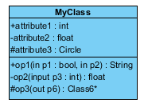

# 入门

## 历史

- 推出时间：1995年
- 最初的名字：Oak（橡树）
- Java名字的由来:印度尼西亚的Java岛，盛产咖啡
- Java之父:James Gosling 

## 特点

- 设计
  - 是一种面向Internet的编程语言
  - 可以在Web浏览器中运行
- 纯粹 “面向对象”
  - 基本概念：类、对象
  - 三大特性：封装、继承、多态
- 跨平台性
  - 使用JVM（Java虚拟机）实现
- 和C语言的对比
  - 舍弃了“指针”，使用“引用”代替
  - 舍弃了运算符重载、多重继承，使用“interface接口”替代
  - 增加了垃圾回收功能
    - 但是Java程序仍然有可能会出现内存泄漏、内存溢出的问题
  - JDK5.1引入了泛型编程(Generic Programming)、类型安全的枚举、不定长参数和自动装/拆箱 

## 版本

- JDK 1.5 = 5.0
- JavaSE 标准版:支持桌面级应用
- JavaEE 企业版:包括Servlet、JSP等，针对Web应用程序开发 
- JavaME 小型版:移动终端

## 应用方向

- 企业级应用

- Android平台应用

- 大数据平台开发

## 运行机制

- 硬件 > 操作系统 > JVM > 字节码文件 > 用户 
- 用JVM跑字节码文件 
- JVM运行在不同操作系统上 

# Java环境安装

## JDK & JRE

- JRE
  - JRE = Java Runtime Environment 
  - Java 运行环境
  - JRE = Java虚拟机(JVM) + Java SE标准类库 
- JDK
  - JDK = Java Development Kit
  - Java开发工具包
  - JDK = JRE + 开发工具集(javac等) 
  - JDK在不同的操作系统上装的JVM是不一样的，所以不同OS下JDK不同 

## JDK的下载

- http://www.oracle.com
- Downloads     / Java for Developers / Java SE / Downloads / Download Accept / download 
- 路径英文，尽量不要包含空格，安装名字最好保留版本号     
- 有时候需要单独安装一个jre，因为eclipse想要指向这个单独的     

- JDK的目录说明
  - bin ： 开发工具 
    - javac 编译
    - java  解释运行
    - javadoc  生成说明文档
  - db ： java实现的数据库文件 
  - include ： c语言编写的头文件 
    - jni = java native interface
  - jre：java运行环境
  - lib：相关jar包，库文件
  - src：java 的一些开源代码，常见类库

## 环境变量PATH配置

- 环境变量path决定了到底使用的是哪一个jdk

- 为什么要配置path？

  - 在配置环境变量之前，是无法在jdk目录以外执行java命令的

- 如何配置path

  1. 计算机 / 属性 / 高级 / 环境变量
  2. 配置path，指向bin目录
  3. 【在开发中一般不直接指向bin，先设置一个变量指向bin的上一级】

- 如何获得windows系统中某一个变量的值

  - %变量名%

- path实际是什么意思？

  - windows系统在执行命令时要搜寻的路径 

  - 当执行某一个命令的时候，会先在当前文件目录中查找，如果没有的话，就开始在path中的文件目录下查找命令      

- 用户变量和系统变量的区别

  - 用户变量只对当前用户有效，系统变量对不同用户都有效 

- classpath是干什么的

  - 查找class文件的路径，如果配置过，一旦找class文件，不在当前目录寻找，直接在classpath中查找

## 常用开发工具

- JBuilder
- NetBeans
- Eclipse——IBM
- myeclipse——eclipse的收费版
- IntelliJ IDEA

# Java程序的基础

## Java中涉及到的文件后缀

### java文件

- 源文件
- 使用javac.exe进行编译
  - 编译命令：javac 文件名.java       
  - 这个时候找的是系统中的文件名，windows不区分大小写，如果win下大小写有误仍能找到

### class文件

- 字节码文件
- 字节码文件的文件名是.java文件中的class名     
- java.exe 运行 
  - 这时候运行的是class，如果大小写有误，Java区分大小写，无法顺利执行结果

## Java程序的入口

- main方法
  - 如果缺少main方法的话可以编译，但无法运行

## JavaDoc

- API = Application Programming Interface 应用编程接口
- 就是API怎么使用的说明书 
- 是通过文档注释实现的 
- Java的API文档 (Java SE     Documentation) 
  - http://www.oracle.com/technetwork/java/javase/downloads/index/html 
  - API包括“包列表区”、“类列表区”和“详细说明区”，每个包下有具体的类，点击类后有详细说明      
- 生成后可以通过.index文件访问

## Java程序的注释

- 单行注释 : // 不参与编译
- 多行注释 : /* */     不参与编译，不可以嵌套使用 
- 文档注释 : /** */     可以被javadoc解析成网页文件 
  - javadoc -d [NewDirName] -author -version      [FileName].java 
  - 生成文件夹中的index可以打开文档说明      

## Java文件 / 命名的规定

- 一个java文件中可以声明多个class 
- 一个java文件中最多有一个类声明为public     class 
- java文件名和文件中的public     class名相同 

## Java的编译过程

- 编译后，会生成一个或多个字节码文件。字节码文件的文件名与java源文件的类名相同 
- 编译修改代码时会将同名的某个class文件名更改为.bak     

## Java在内存中的结构

- Java的内存结构是在JVM中体现的 
- 在不同JDK中内存结构也有一点不一样 
- 比较稳定的结构是
  - 栈stack:比较瘦 (是一个线性表，相当于一维，所以比较瘦) ：存放局部变量
  - 堆heap:(不是线性表，比较复杂)      ：存放new出来的东西:对象、数组 
  - 方法区：包括 常量池 和 静态域 和      其他(类加载的信息等) 

## Java中的地址值

- 通过stack空间的地址值可以找到heap中的内容，但是这里的地址值并不是内存中的真实地址，是JVM算出来的虚     拟的地址值。比C语言中的要简单。 
- Java中只要是引用类型的变量，要么存的是null，要么存的就是地址值     

## 特殊返回值 -1

- java 中返回值为-1的时候，一般意思就是没找到 

# 基础语法

## 关键字

- 所有的关键字都是小写的
- 定义数据类型的关键字
  - class 、interface、enum、byte、short、int、long、float、double、char、boolean、void
- 定义流程控制的关键字
  - if、else、switch、case、default、while、do、for、break、continue、return
  - return
    - 结束方法体
    - 结束方法 / 返回值
    - return后面不可以声明执行语句
- 定义访问权限的关键字
  - private、protected、public
- 定义类、函数、变量修饰符的关键字
  - abstract、final、static、synchronized
- 定义类与类之间的关系
  - extends、implements
- 处理异常
  - try、catch、finally、throw、throws
- 包
  - package、import
- 其他
  - native、strictfp
  - transient
  - volatile
  - assert
  - true、false、null

## 保留字

- goto
- const

## 标识符 identifier

- 标识符的语法规范
  - 凡是自己可以起名字的地方都叫做identifier
  - 英文字母、数字、下划线、美元符号、中文（不推荐
  - 数字不开头，不可以和关键字保留字重名，不可以有空格
  - 严格区分大小写
- 命名规范
  - 包：xxxyyyzzz
  - 类：XxxYyyZzz
  - 接口：XxxYyyZzz
  - 变量：xxxYyyZzz
  - 方法：xxxYyyZzz
  - 常量：XXX_YYY_ZZZ

## 变量

### 变量的基本知识

- 内存中的一个存储区域，该区域的数据可以在同一类型范围内不断变化
- 程序中的基本存储单元，用于在内存中保存数据
- 先声明、后使用
- 定义的变量不初始化是不允许被使用的
- 在作用域内有效
- 同一个作用域下变量不能重名
- Java是强类型，必须指明变量类型
- 定义格式
  - 数据类型 变量名 = 变量值
- 整型值默认用int存储，浮点型默认用double存储

### 数据类型

- 数据类型 
  - 基本数据类型
  - 引用数据类型
- 基本数据类型
  - 数值型
    - 整型 byte short int long
    - 浮点型 float double
  - 字符型 char
  - 布尔型 boolean
- 数值型
  - 整数类型
  - 浮点类型
- 引用数据类型
  - 类 class
  - 接口 interface
  - 数组 array

### 各种数值类型的变量范围

- 整型变量

  - byte 1字节 = 8bit = -128～127【bit是计算机中最小的存储单位，byte是计算机中的基本存储单元
  - short 2字节 = -2^15~2^15-1
  - int 4字节 = -2^31~2^31-1
  - long 8字节 = -2^63~2^63-1 
  - 特点
    - 有一位是符号位置
    - 0被分在了正数里面
    - long数据需要在末尾加上 L/l 表述

- 浮点型变量

  - float 4字节 精确7位有效数字 = -3.403E38 ~ 3.403E38
  - double 8字节 精确14位有效数字 = -1.798E308 ~ 1.798E308
  - float数据需要在末尾加上 F/f 表述

- 字符型变量

  - char 1个字符 = 2个字节 = 16bit 
  - 定义时使用’单引号’，里面只能写一个字符
  - 转义字符
    - \n 换行
    - \u Unicode
    - \\\

- 布尔型变量

  - 只有true和false两个值
  - 在条件判断和循环中常使用
  - if(booleanX){}

- 变量的自动类型提升 和 强制类型转换

  - 布尔型在Java中无法做运算，这里讨论的只是7种基本数据类型之间的运算，不包含布尔类型 

  - byte + int =     int(最小需要用int接收)(如果用float接收会自动补一个 .0)

  - short + char = int

  - char + byte = int

  - byte、char 、short     < int < long < float < double 【按照表示的数的范围的大小 

  - 强制类型转换超出范围，截断操作，产生精度损失

    - int i1 = (int)d1; 

      不超出范围则没有精度损失 

### Java中的Stirng类型

- 是一种引用数据类型
- 双引号印起来的部分就是字符串，可以是空字符串【chat不可以是空字符串
- +号代表字符串的连接运算
- 字符串和任何数据类型做运算，一定是连接运算，结果都是String类型

## 运算符

### 算术运算符

- +、-、*、/、%、前++、后++、前--、后--、字符串连接+、正号、负号
- 注意点
  - % 结果的符号与被模数(%前面的数)的符号相同 
  - 不放入运算式中的话，先++和后++没有区别
  - 自增自减不会改变数据类型，注意数据溢出问题
  - 获得一个数字个、十、百位上的数字
    - 百：num/100
    - 十：num % 100 /     10
    - 个：num % 10

### 赋值运算符

- =、+=、-=、*=、/=、%=
- 特点
  - 不会改变数据本身的数据类型
  - 连续赋值 i2=j2=10

### 比较运算符

- ==、!=、<、>、<=、>=
- instanceof用于检查是否是类的对象，比如"Hello" instanceof String

### 逻辑运算符、

- &、&&、|、||、!、^
- 注意
  - 逻辑运算符操作的都是布尔类型的变量
  - &和&&的运算结果相同，但是
    - 当符号左边是true时，两者都会执行右边的运算 
    - 当符号左边是false时，&继续执行符号右边的运算，&&不再执行右边的运算

### 位运算符

- <<、>>、>>>无符号右移、&与、|或、^异或（相同则结果是0，不同则结果是1）、!取反
- 如何判断是逻辑运算还是位运算
  - 取决于操作的数据类型
  - 布尔值 => 逻辑运算
  - 数值型 => 位运算
- 左移右移时的补位原则
  - 左移，右侧补0
  - 右移，左补一个和最高位一样的，根据最高位是0还是1，补相同的0/1
  - 无符号右移，不管最高位是什么，移后都补0。所以一个负数无符号移动1位就会变成正数

### 三元运算符

- (结果只能是布尔类型的条件表达式) ？ 真A ：假B 
- A和B必须可以统一为一个类型
- 凡是三元运算符的部分，都可以改写为if-else

### 运算符的优先级

- 开发中，想要早运算的，加上括号

### 比较大小

- 返回值
  - 正数：当前对象大
  - 负数：当前对象小
  - 0 ： 相等
- 对象的比较
  - 一般是每一个属性依次比较
  - == 对于引用数据类型来讲，比较的是两个引用数据类型变量的地址值是否相同

## 流程控制

### 选择结构

#### if - else

- 语法

  ```java
  if(条件表达式){
    
  }else if(条件表达式){
    
  }else if(条件表达式){
    
  }else{
    
  }
  ```

- 如何决定条件表达式的先后顺序

  - 如果多个条件表达式之间是【互斥】关系，哪个判断和执行语句声明在上面还是下面，无所谓。
  - 如果多个条件表达式之间有【交集】的关系，需要根据实际情况，考虑清楚哪个结构在上面。
  - 如果多个条件表达式之间有【包含】关系，需要将范围小的写在上面，否则，范围小的就没机会执行了。

- 不加大括号，用;分隔语句也可以，但不推荐。

#### switch - case

- 语法

  ```java
  switch(表达式){
    case 常量1:
      执行语句1;
      //break;
    default:
      执行语句;
      //break;
  }
  ```

- 根据switch表达式中的值，一次匹配各个case中的常量，一旦匹配成功，则进入相应case结构中，调用其执行语     句。当调用完执行语句后，仍继续向下执行其他case结构中的执行语句，直到遇到break关键字或此switch-case结 构末尾为止结束。 
- break可以使用在switch-case结构中，表示一旦执行到此关键字，就跳出switch-case结构。 break关键字是可选的。 
- switch结构中的表达式，只能是如下6种数据类型之一
  - byte 
  - short 
  - char 
  - int 
  - 枚举(5.0) 
  - String(7.0)
- switch不允许用布尔类型
- case之后只能声明常量，不能声明范围。
- default相当于if-else中的else，是可选的，无论位置在哪里，都会判断完所有的case后进入

#### if - else 和 switch - case 的对比

- 凡是可以使用switch-case的结构都可以转换为if-else，反之不成立。 
- 既可以使用switch-case又可以使用if-else的，优先选择使用if-else，执行效率比较高。     

### 循环结构

#### 循环结构的理论组成

- 初始化部分
- 循环条件部分 => 布尔类型
- 循环体部分
- 迭代部分

#### for循环

- 语法

  ```java
  for(1; 2; 4){
    3
  }
  //执行顺序：1 2 3 4 ......2 3 4...... 2 
  ```

- 1和3可以有多个语句，但要用，连接 

#### while循环

- 语法

  ```java
  1; //初始化 
  while(2){ 
  3; 
  4; //迭代 
  } 
  //执行顺序：1 2 3 4.... 2 3 4 .... 2 
  ```

#### do - while循环

- 语法

  ```java
  1;
  do{
  3; 
  4;
  }while(2);
  //执行顺序：1 3 4 2 3 4 ..... 2 
  ```

  

#### 不同循环写法的对比

- while 循环 和 for 循环，两者一定可以互换，唯一不同是初始化语句的作用范围不同。
- do-while和【while 循环 和 for 循环】在循环多次的时候完全没有区别 ，在do-while只执行一次 while/if不执行的时候不同 
- 开发中使用while/for更多一些 

#### 无限循环

- while（true)
- for( ; ; )

#### 嵌套循环

- 一般不要超过3层

#### 和循环相关的关键词

- break 和 continue

  - break， 结束当前循环，可以用在switch-case或循环结构中，默认跳出包裹此关键字最近的一层循环

  - continue，只能用在循环结构中，结束当次循环

  - break和continue关键字后面都不能有执行语句，否则编译直接报错 


- return
  - 用来结束一个方法


### 递归

- recursion
- 一个方法体内调用方法本身，相当于一种循环
- 方法递归包含了一种隐藏的循环，它会反复执行某段代码，但这种重复执行无需循环控制
- 递归一定要向已知方向递归
  - 单层的时候的出口
  - 迭代部分

## 数组

### 使用特点

- 是多个相同类型的数据按照一定顺序排列组合，然后用一个名字命名，通过编号的方式统一管理
- 有序排列的
- 数组的长度一旦确定，就不可以修改
- 数组按照维度可以分为“一维数组”和“多维数组”

### 内存特点

- 数组一旦初始化完成，长度就确定了。（不然无法确定在内存中开辟多大的长度）
- 数组在内存中开辟一块连续的空间
- 属于引用数据类型的变量，数据元素既可以是基本数据类型，也可以是引用数据类型。
- 本质是指针
  - 没有stack的指针指向heap的时候，内存会被自动回收
  - 字符串是存放在方法区的常量池中的，这里先认为是heap中的，后续再补充其他知识

### 数组的长度

- 数组的第一个维度就是数组的长度
- 数组的索引从0开始，到长度-1结束

### 数组元素的默认初始化值

| 类型         | -             | 初始化值 |
| ------------ | ------------- | -------- |
| 整型         | int           | 0        |
| 浮点型       | float  double | 0.0      |
| 字符型       | char          | ASCII 0  |
| 布尔型       | boolean       | false    |
| 引用数据类型 |               | null     |

### 一维数组的基本使用

#### 声明

- 必须赋值或指定长度

- 静态初始化

  - 初始化 + 赋值

  ```java
  int[] ids;
  ids = new int[]{1001, 1002, 1003, 1004};
  ```

- 动态初始化

  - 初始化 + 指定长度

  ```java
  String [] names = new String[5];
  ```

#### 调用指定位置的元素

- 通过角标调用
- names[0] = "pool";

#### 获取数组的长度

- 用 .length
- System.out.println(names.length);

#### 如何遍历数组

- 用for循环

  ```java
  for(int i = 0; i < names.length; i++){
  	System.out.prinln(names[i]);
  }
  ```

### 二维数组

#### 概念

- 如果数组的元素又是一个数组，就是一个二维数组。
- 从数组的底层运行机制来看，其实没有多位数组。

#### 声明和初始化

- 第一维的长度必须指定，不能既指定长度又指定元素 

- 静态初始化

  - 初始化 + 赋值

  - 成员数组的长度可以不一样

    ```java
    int [] [] arr1 = new int[] []{{1, 2, 3}, {4, 5}, {6, 7, 8}}; 
    ```

- 动态初始化

  - 初始化 + 指定成员数组的长度

    ```java
    String[][] arr2 = new String[3][2];
    ```

  - 初始化 + 不指定成员数组的长度

    ```java
    String[][] arr3 = new String[3][]; 
    ```

#### 调用数组指定位置的元素

```java
arr[0][1]
```

#### 获取数组长度

- 获取stack长度

  ```java
  arr.length
  ```

- 获取第一个元素的数组长度

  ```java
  arr[0].length
  ```

#### 遍历二维数组

```java
for(int i = 0; i < arr1.length; i++){
  for(int j = 0; j < arr1[i].length; j++){ 
    System.out.println(arr1[i][j]);
  }
} 
```

#### 数组元素的默认初始化值

##### 两个维度都被明确指定的情况

- 外层元素
  - 二维数组的外层元素要么就是地址值，要么就是null
  - 地址值[I@15db9742
  - 单个 [ 是一维，两个 [[ 是二维 
  - 大写i:int型
  - @:表示地址，后面是一个16进制 
- 内层元素
  - 根据类型初值不同
  - int 0、float 0.0、String null

##### 只指定了第一维的情况

- 外层元素 null
- 内层元素 空指针异常

### 数组相关一些特殊的代码写法

- 二维，[]放在类型后面也可以，放在变量名后面也可以

  ```java
  int[] arr[] = new int[][]{{1, 2, 3}, {4, 5}, {6, 7, 8}};
  
  int arr[][] = new int[][]{{1, 2, 3}, {4, 5}, {6, 7, 8}};
  ```

- array2 = array1 

  - 是将array1的地址给了array2 ，就像电脑中的快捷方式指向一样 

- 数组也可以看成是一个特殊的类，继承自Object

## 类和对象

### 基础知识

- Java中一切都是对象，和前端交互时的标签组合、和后端交互时的DB中的表，都会对应JAVA中的一个对象。

- 类：对一类事物的描述，是抽象的，概念上的定义；

  对象：实际存在的该类事物的每一个个体，也称为实例 instance

- 设计类，其实就是设计类的成员

- 对象的特点

  - 可以有属性field、行为
  - 同一个类的两个instance，独立地拥有一套类的属性
  - 实例化
    - Person p1 = new Person();
  - 对象的失败复制
    - 如果写成Person p3 = p1; 就是将p1变量保存的对象地址值赋给p3，导致两者指向堆空间中的同一个对象实体。

- 调用属性 / 方法

  - 调用属性 ： 对象 . 属性名
  - 调用方法 ： 对象 .     方法名

- 一般在Java中调用方法，都是在class内定义了各种方法。

  在调用的时候，在main方法内部，定义一个本class的实体。

  然后再调用各个方法。

### 封装性

- 控制内部控制、对外暴露两部分

- 实现封装性的权限修饰符 —— Java中有四种

  |             | 类内部 | 同一个package | 不同包的子类 | 同一个工程 |
  | ----------- | ------ | ------------- | ------------ | ---------- |
  | private     | Yes    |               |              |            |
  | 缺省default | Yes    | Yes           |              |            |
  | protected   | Yes    | Yes           | Yes          |            |
  | public      | Yes    | Yes           | Yes          | Yes        |

- 权限修饰符可以修饰什么
  - 类的内部结构
  - 属性
  - 方法
  - 构造器
  - 内部类
  - 类：修饰类的话，只能用default和public

### 继承性

#### 好处

- 提高代码复用性
- 为“多态性”的使用，提供了前提

#### 语法

- class A extends B {}
- sub class 子类
- super class 父类

#### 特点

- 一旦继承，subclass会继承superclass声明的结构、属性、方法
- superclass中的private属性，subclass也会继承。但无法直接访问，需要接触set/get方法

#### 规定

- 一个superclass可以有多个subclass
- 一个娃只能有一个爸
- 可以多层继承

#### 重写

- 子类可以重写父类的方法

- 重写后的方法，优先级更高

- 重写时，权限修饰符的规定

  => 想要覆盖掉别人，那必须权限更大

  => 子类不能重写父类中声明为private权限的方法

- 重写时，返回值的规定

  => void 只能是 void

  => 重写可以更小【父类返回值Object 子类可以返回String】

  => 基本数据类型 必须 相同

- 重写时，异常的规定

  => 父Exception 子RuntimeException

- 实际开发中的重写

  - 一般就直接copy父类函数声明就行
  - 直接写函数名，然后使用alt+/自动补全快捷键，就会提示出来重写的方法声明

- static方法不可被重写

  - 静态方法不能够被覆盖，是随着类的加载被加载的

### 构造器 constructor

- 一个类中，至少会有一个构造器

- 举例

  ```java
  class Person{
    //构造器 权限修饰符 类名(形参列表) { }
    public Person(){
  
    }
  }
  ```

- Java系统会自动定义构造器

  - 默认构造器的权限：取决于class的权限
  - 如果没有显式的定义类的构造器的话，则系统默认提供一个空参的构造器
  - 一个类中可以有多个构造器，类似重载，参数内容不同
  - 一旦显式定义了类的构造器，系统就不再提供默认的空参构造器了

### this

#### 为什么需要使用this

- 根据见名知意的要求，我们在写set方法的时候可能会想写成如下的样子

  ```java
  public void setAge(int age){
    age = age;
  }
  ```

  这种写法编译不会报错，但其实运行的时候这三个age全都被“就近原则”看成了同一个age

- 为了区分上述场景中的“属性”和“形参”，我们引入了this

  ```java
  public void setAge(int age){
    this.age = age;
  }
  ```

  this代表当前对象，所以前面的就是属性，后面的就是形参了

#### this的使用

- this可以修饰 属性、方法、构造器【this(); this(age);】
- 规定：“this(形参列表)”必须声明在当前构造器的首行，且只能调用一次
- this 单独使用，表示当前对象 boy.marry(this)

### 匿名对象

- 匿名对象就是没有名字的对象
- new Phone().sendEmail();
- 这种情况下对象只能用一次，再使用匿名对象的时候其实对应的是一个新的对象。
- 开发中匿名对象常用的使用方法——常常作为参数传递下去使用，从而达到多次调用的目的。

```java
class PhoneMall{
  public void show(Phone phone){
    phone.sendemail();
    phone.playgame();
  }
}
//调用
PhoneMall mall = new PhoneMall();
mall.show(new Phone())

//类比理解一下匿名函数的这种用法
//小A写了一封信，没写名字，但是转送的时候小B帮小A写上了名字

```

### 重载

#### 概念

- 重载overload
- 在同一个类中，允许存在一个以上的同名方法，只要他们的参数个数或者参数类型不同即可。
- 特点
  - 函数名相同
  - 返回值相同 / 不同
  - 参数列表必须不相同（个数或类型不同）
  - 参数类型相同，顺序不同 =>     也算作参数不同
  - 调用时，根据方法参数列表的不同来区别

#### 重载进阶版—— 可变个数的形参

##### 概念 —— Varargs机制

- JavaSE5.0开始，提供了Varargs(variable number of arguments)机制
- 允许直接定义能和多个实参相匹配的形参
- 目的：提供一种更简单的方式，来传递个数可变的实参

##### 可变个数形参

- 格式

  - 数据类型 ... 变量名

- 举例

  ```java
  public void show(String ... strs){
  }
  //=> 这个方法可以识别匹配以下调用
  test.show("hello");
  test.show("hello","world");
  test.show("");
  //也就是说，传入多少个指定类型的参数都可以
  ```

- 注意点

  - 形参不同，可以和原方法重载。

    ==> show(String ... strs)可以和show(String str)同时存在。

  - 形参类型相同的数组，不可以构成重载。

    ==> 比如 show(String ... strs)可以和show(String[] str)不可以同时存在

  - 可变个数形参，必须放在参数表的末尾

    show(int i, String ... strs)可以

    shwo(String ... strs, int i)不可以

  - 同一个方法，最多只能声明一个可变个数形参

- 应用实例

  - 数据库中根据某些条件查找的时候，就常常会用到可变个数形参。

### 对象的内存解析

- 内存解析，是发生在“运行”阶段的。
  - 编译完程序之后，生成一个或多个字节码文件。
  - 我们使用JVM中的“类的加载器”和“解释器”对生成的字节码文件进行解释运行。意味着，需要将字节码文件对应的类加载到内存中，涉及到内存解析。
  - JVM的内存解析中，主要关心“运行时数据区”，关注heap，method area，VM stack
  - 我们将局部变量存储在stack结构中
  - 我们将局部变量存储在heap结构中
  - 类的属性加载在heap空间中（非static，static在方法区）

## package

### package的管理

- 目的：为了更好地维护管理class
- 使用方法
  - 使用package声明类或接口所属的包，声明必须在源文件的首行（前面没有别的就算）
  - 命名方法：xxxyyyzzz
  - 包名中每出现一次【 . 】，就代表一层目录
  - 同一个package下，不能出现同名的interface、class

### import 

- 作用

  - 导入指定包下的类、接口

- 使用方法

  - 声明在package和class之间
  - 可以使用XXX.*的方式，表示打入xxx包下的所有结构
  - 如果在源文件中，使用了不同package下同名class，则必须至少有一个类需要以全类名的方式显示

- 可以省略import的情况

  - 类或接口是java.lang下定义的
  - 使用的类或接口是本包下定义的

- 全类名

- import static 

  - 导入指定 class / interface 中的静态结构(属性 / 方法)

  - 举例

    如果写 import static java.lang.System.*;  那么就可以直接out.println

## 注释

- //
- /** xxxxxxxxxxx */

# JavaBean

## 基本介绍

- JavaBean是一种Java语言写成的【可重用组件】

- 所谓JavaBean，是指符合如下标准的Java类

  - 类是公共的

  - 有一个无参的公共的构造器

  - 有属性，且有对应的get、set方法

## 作用

- 用户可以使用JavaBean将功能、处理、值、数据库访问和其他任何可以用Java代码创造的对象进行打包

- 其他开发者可以通过内部的JSP页面、Servle、其他JavaBean、applet程序或应用来使用被JavaBean打包的对象

- 用户可以认为JavaBean提供了一种复制粘贴功能

- 应用 —— 数据库中的表格，对应Java中的一个类，这个类就可以声明为一个JavaBean

# UML 类图

- 主要信息
  - 类名
  - 属性名：属性类型
  - 方法（如果有下划线，代表构造器）
    - [ + ] 代表 public
    - [ - ] 代表 private
    - [ # ] 代表 protected
    - [方法类型] 方法名（参数名：参数类型）：返回值类型




# Java 的内存

## Stack

- 通常所说的stack是指虚拟机stack
- 存储局部变量
  - 局部变量表存放编译期可知长度的各种基本数据类型
  - 对象引用（reference类型，它不等同于对象本身，是对象在堆内存放的首地址）
- 普通的变量声明在stack中
- 方法完成后，stack自动释放

## Heap

- 存放对象实例（广义上的对象，Scanner数组等均包含在内）
- 创建的各种实体都在这里、类的属性都声明在堆中

## 方法区

- 类信息、常量、静态变量等都在方法区进行加载
- 用于存储已被虚拟机加载的数据

## 形参

- 形参是基本数据类型时：将实参基本数据类型变量的“数据值”传递给形参
- 形参是引用数据类型时：将实参基本数据类型变量的“地址值”传递给形参

# JavaDoc

## 类级别

```java
/**
 * 这个类用于管理用户账户的功能。
 * 它支持创建账户、验证账户信息、更新账户信息等操作。
 * <p>
 * 示例:
 * <pre>
 *     AccountManager manager = new AccountManager();
 *     manager.createAccount("username", "password");
 *     boolean isValid = manager.validateAccount("username", "password");
 * </pre>
 * </p>
 * <p>
 * 注意：此类在多线程环境下不是线程安全的。如果需要线程安全的操作，请使用适当的同步机制。
 * </p>
 *
 * @author 作者名
 * @version 1.0
 * @since 2024-11-12
 */
public class AccountManager {
    // 类的代码
}
```

## 方法级别

```java
/**
 * 创建一个新的用户账户。
 * <p>
 * 这个方法会根据提供的用户名和密码创建一个新的用户账户。用户名必须是唯一的，密码不能为空。
 * </p>
 *
 * @param username 用户名，不能为空且必须是唯一的。
 * @param password 用户密码，不能为空。
 * @throws IllegalArgumentException 如果用户名或密码不符合要求。
 * @throws UserAlreadyExistsException 如果用户名已经存在。
 */
public void createAccount(String username, String password) throws IllegalArgumentException, UserAlreadyExistsException {
    // 方法实现
}
```


## 字段级别的 JavaDoc 注释

```java
/**
 * 存储当前用户的用户名。
 * 该字段必须在用户登录后初始化。
 */
private String username;

/**
 * 存储用户的账户余额。初始值为 0。
 */
private double balance;
```

# 更新版本及特性

## module-info.java 和 模块系统

### 导入版本

Java9

### 功能

- 解决依赖管理、封装问题
- 指定哪些包是对外开放的，哪些仅在模块内部使用，使得class和package的封装性更强，避免不必要的暴露

### 关键字

- requires
  - 指定模块所依赖的其他模块
  - 编译器和JVM在运行时会根据这些依赖关系加载模块
  - 好处：避免classpath方式加载类时可能出现的依赖冲突
    - 本来：若存在两个版本的同一个库，会有冲突
    - 更改后：通过模块名区分模块并管理依赖性，减少冲突可能
  - eg
    - requires javafx.controls;
- opens xxxx to yyyy
  - 打开 xxxx 包 给 yyyy，使得可以通过反射访问包中的类
  - eg
    - opens com.example.demo to javafx.fxml;
- exports
  - 导出package，使得其他模块可以访问其中的class
  - eg
    - exports com.example.demo;

### 优点

- 拆分了Java的标准库，使得Java在运行环境可以根据需要只加载必要的模块，减少资源使用。
- 可以根据需要创建仅包含所需模块的定制运行时环境

# Java & 游戏开发

## 常用库

- javafx.controls
  - 按钮、标签等UI控件
- javafx.fxml
  - 用于UI布局管理和FXML文件加载
- 

## 框架

### JavaFX

#### 基本介绍 & 特征

- 用于开发 **富客户端应用程序**（Rich Client Application）的框架
- UI支持
  - 提供了大量的 GUI 控件，如按钮（Button）、标签（Label）、文本框（TextField）、列表（ListView）等，可以用于创建用户界面

- FXML
  - 可以使用 FXML（基于 XML 的界面描述文件）来构建 UI，允许开发者将界面设计与业务逻辑分离
- 多媒体支持
  - JavaFX 内置了对音频、视频和图像的支持，可以直接播放音频和视频文件，使得多媒体处理更加简便。
  - JavaFX 提供了强大的动画 API，支持平移动画、缩放、旋转等，并且可以通过 `Timeline` 和 `KeyFrame` 实现复杂的动画效果。
  - JavaFX 提供了强大的动画 API，支持平移动画、缩放、旋转等，并且可以通过 `Timeline` 和 `KeyFrame` 实现复杂的动画效果。

#### FXML 的使用

##### 常用标签

- **`VBox`**：这是一个 JavaFX 布局容器，用于垂直排列子元素。

- **`Label` 和 `Button`**：分别是标签和按钮控件，定义了它们的 `text` 属性。

- **`onAction="#handleButtonClick"`**：指定了按钮的点击事件，并引用控制器类中 `handleButtonClick` 方法（在控制器类中实现该方法，以响应按钮点击事件）。

- **`fx:controller`**：定义了此 FXML 文件对应的控制器类，通常用于管理界面事件和逻辑。

  ```xml
  <?xml version="1.0" encoding="UTF-8"?>
  
  <!-- 定义一个 VBox 布局，包含一个 Label 和一个 Button -->
  <VBox xmlns="http://javafx.com/javafx" xmlns:fx="http://javafx.com/fxml" fx:controller="com.example.demo.controller.MyController">
      <Label text="Hello, World!" />
      <Button text="Click Me" onAction="#handleButtonClick" />
  </VBox>
  ```

#### 对应的Controller

```java
package com.example.demo.controller;

import javafx.fxml.FXML;
import javafx.scene.control.Button;
import javafx.scene.control.Label;

public class MyController {

    @FXML
    private Label label;

    @FXML
    private Button button;

    @FXML
    private void handleButtonClick() {
        label.setText("Button was clicked!");
    }
}

```

- `@FXML` 注解用于标记与 FXML 文件中对应的 UI 控件，如 `label` 和 `button`，这样可以在代码中直接引用和操作这些控件。
- `handleButtonClick` 方法就是按钮点击事件的处理方法。当用户点击按钮时，按钮会触发此方法，将 `label` 的文字更改为 "Button was clicked!"。

#### FXMLoader类 加载FXML文件

```java
FXMLLoader loader = new FXMLLoader(getClass().getResource("myLayout.fxml"));
Parent root = loader.load();
```

#### JavaFX 的基本结构

- 程序通常继承自 `javafx.application.Application` 类，并且会在 `start()` 方法中设置界面和启动应用程序。

- EG

  ```java
  import javafx.application.Application;
  import javafx.scene.Scene;
  import javafx.scene.control.Button;
  import javafx.scene.layout.StackPane;
  import javafx.stage.Stage;
  
  public class HelloJavaFX extends Application {
  
      @Override
      public void start(Stage primaryStage) {
          // 创建一个按钮
          Button button = new Button("Click Me");
          button.setOnAction(e -> System.out.println("Hello, JavaFX!"));
  
          // 创建布局容器
          StackPane root = new StackPane();
          root.getChildren().add(button);
  
          // 创建场景并设置到主舞台
          Scene scene = new Scene(root, 300, 200);
          primaryStage.setTitle("Hello JavaFX");
          primaryStage.setScene(scene);
          primaryStage.show();
      }
  
      public static void main(String[] args) {
          launch(args);
      }
  }
  
  ```

- 运行机制
  - 启动
    - 加载laugh()方法，启动JavaFX应用，JavaFX Application Thread启动并调用start()方法
  - 创建舞台和场景
    - 在start方法中创建Stage、Scene
    - 添加控件到布局
    - 使用primaryStage.show()显示main窗口
  - 事件循环
    - 处理和用户交互
  - 退出
    - 主窗口关闭时，应用程序退出

#### JavaFX 的主要组件

##### Stage —— 窗口本身

- 应用的窗口
- 一个application可以有多个窗口，每个窗口对应一个stage实例
- 主窗口 是 primaryStage，可以通过show()方法显示

##### Scene —— 界面内容

- 管理页面内容的容器，一个Stage可以有一个Scene
- 一个Stage可以在不同Scene中切换

##### 布局容器

- HBox
- VBox
- BorderPane
- GridPane

##### 控件

- Button
- Label
- TextField

#### 事件处理

- 点击
- 输入

# Java版本管理工具

```shell
curl -s "https://get.sdkman.io" | bash
source "$HOME/.sdkman/bin/sdkman-init.sh"
sdk list java
sdk install java 23.0.1-open
java -version

```

