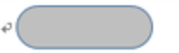
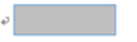
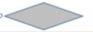
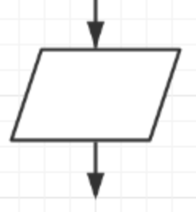
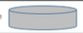
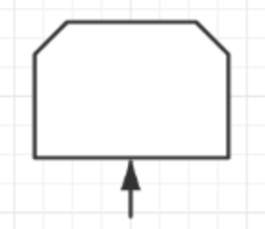
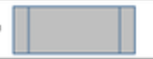
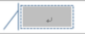

# 常用符号

| 负号                                                         | 意义                         |
| ------------------------------------------------------------ | ---------------------------- |
|   | 开始/结束                    |
|  | 流程                         |
|  | 判定                         |
|  | 文档--输入或输出的文件       |
|  | 输入输出                     |
|  | 数据（文件/存档）            |
|  | 循环上限                     |
|  | 子流程，重复使用某一处理程序 |
|  | 接点，流程图之间的借口       |
|  | 备注                         |

# 对应范围

- 顺序结构
- 选择结构
- 循环结构

# 原则

- 从左到右
- 从上到下
- 开始符号开始，结束符号结束
- 符号大小保持一致，连接线不交叉
- 并性关系的，需要放在同一高度
- 单一入口 & 单一出口

# 常用网站

- draw.io
